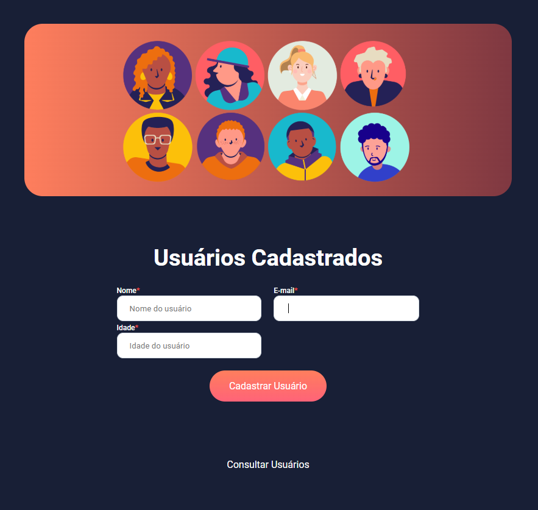

## Iniciando no React - Cadastro de Usuários

 

  

## Sobre o Curso

Curso do DevClub Full Stack onde tive meu primeiro contato com React. Usamos a ferramenta Vite para iniciar o projeto. Eslint para configurar o código e Axios para conectar com o backend. Reac Router DOM pras rotas e Toastify pras mensagens de sucesso e erro.

Aqui esta meu caderno de anotações: [Caderno](https://igorlzzrtt.notion.site/React-16357f4b771580e38153d3b79bbb8941?pvs=73)

Backend do projeto: [GitHub](https://github.com/igorlazzaretti/Node.js-Cadastro-Usuarios-DevClub)

## Sobre o Professor

 

Sou ex-eletricista do Metrô de São Paulo e fiz a minha transição de carreira graças a programação. Comecei no mercado aos “trancos e barrancos”, estudando no meu tempo livre que tinha nos feriados e fins de semana para me tornar programador.Tomei 13 NÃOs antes de aparecer meu primeiro SIM, mas ele veio – mesmo sem ter faculdade! Meu primeiro emprego foi como programador no Santander, mas também já trabalhei em empresas como BTG Pactual, PI Investimentos e Toro Investimentos.

Hoje o meu propósito é ajudar o máximo de pessoas a transformarem suas vidas por meio da programação.   

Linkedin: [Rodolfo Mori](https://www.linkedin.com/in/rodolfomori/)

## Tecnologias Utilizadas

## Sobre o Desenvolvedor

🎓 Análise de Sistemas - Cruzeiro do Sul  
💻 Estudante FullStack: DevClub / Dio.me 
👩🏻‍💻 Autor do Site: <a href="https://igorlazzaretti.com/">igorlazzaretti.com</a>  
📚 Leitor e Estudante de Inglês  
🧙‍♂️ Fã de Harry Potter     
💾 <a href="https://github.com/igorlazzaretti?tab=repositories">Veja todos meus repositórios</a>   

##

> "Acredite nos seus sonhos"   - Igor Dossin Lazzaretti

